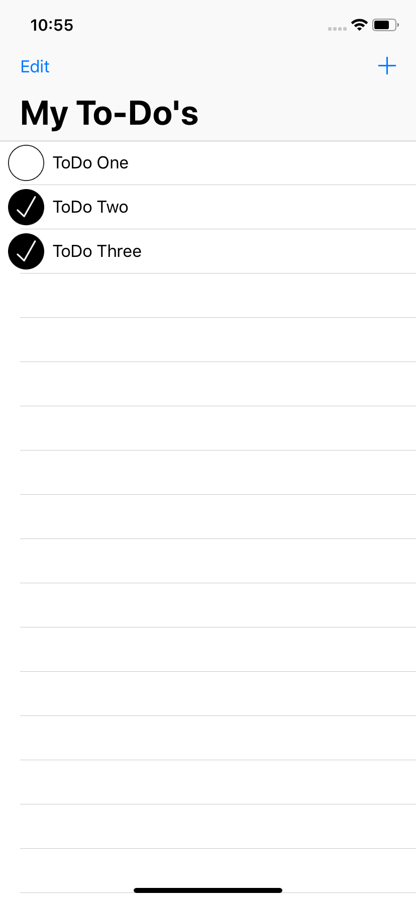
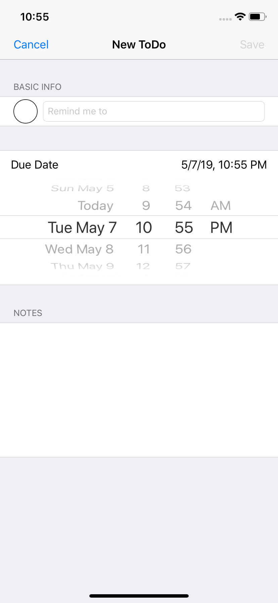

ToDoLIst

About: A to do list app where the user can add and save tasks to a list.

. 

Description: This app allows you to add, modify, and delete items in the list using a custom input screen. Depending on what type
of items are on your list, you can choose from various controls to give your users the best possible form of input.

Technologies Used: Interface Builder, Foundation & UIKIt, TableView Swift, Xcode
